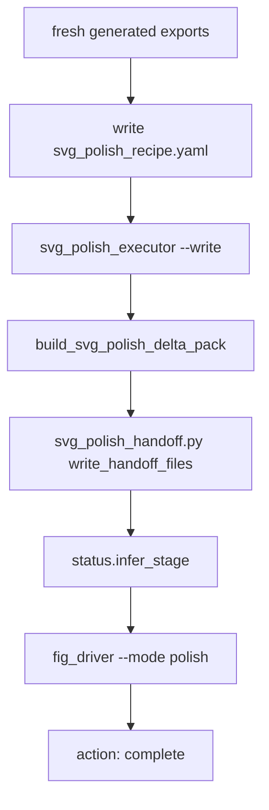

# Issue 46 Polished-SVG Clean Dogfood Design

## Summary

Issue 46 adds a deterministic integration-style test for the shipped SVG polish
layer. It does not add new public behavior. The value is contract coverage:
the plugin must prove that the clean route from bounded recipe to final
polished-SVG closure works as one workflow.

## Route Under Test

The test fixture is temporary and synthetic because real examples are often in
active authoring states. That keeps CI deterministic and avoids mutating user
figure work.

## Fixture Contract

The temporary fixture must include:

- `spec.yaml` with `final_artifact.kind: polished_svg`;
- source TeX, briefing, critique, generated PDF/SVG/PNG/TIF exports;
- a fresh `polish/svg_polish_recipe.yaml`;
- a polished SVG created by the executor;
- a delta manifest created by the delta pack;
- a handoff audit and manifest created by the handoff writer.

The source SVG must contain one stable element id so the recipe can apply a
bounded visual-only action. The generated export files must not be edited by
the executor.

## Status And Driver Contract

After handoff:

- `/fig_status` must report:
  - `render_state: FRESH`
  - `export_state: FRESH`
  - `final_artifact_kind: polished_svg`
  - `final_artifact_state: FRESH`
- `/fig_driver --mode polish` must report:
  - `action: complete`
  - `safe_command: null`
  - `stop_boundary: null`

The test should not require real `qpdf` parsing for stub PDFs; it may use the
same filesystem-only export freshness stub pattern used by `test_fig_driver.py`.

## Non-Goals

This issue does not prove that a real figure is aesthetically excellent. It
only proves the plugin route is internally coherent and ready to host real
figure dogfood.
